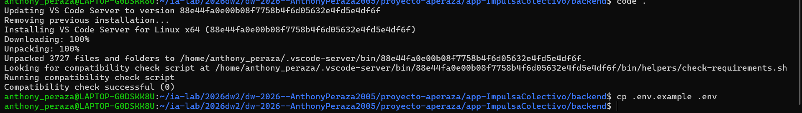

# Proceso manual de backend

**Objetivo de la fase:** Dejar el esqueleto oficial Nest corriendo en un puerto libre, con Git inicial.

## 1.1 Crear carpeta 

## **1.2 — Instalar Nest CLI (si no existe)**  **1.3 — Crear proyecto NestJS**

#### **1.4 — Crear `.env` mínimo (puerto)**

## **FASE 2 — `01_BASE_DEPS_Y_PUERTO`**

**Objetivo de la fase:** Instalar el stack profesional y evitar que un `start:dev` colgado bloquee el puerto.

#### **2.1 — Dependencias de producción**

#### **2.2 — Dependencias de desarrollo**

#### **2.3 — Script para liberar puerto (evita EADDRINUSE)**

#### **2.4 — Actualizar scripts npm en package.json**

#### **2.5 — Verificar arranque base**

## **FASE 3 — `02_BASE_ESTRUCTURA_CA`**

### **Estructura de carpetas Clean Architecture**

> **Objetivo de la fase:** Crear el mapa mental: config / common / infrastructure / features (business + auth).

#### **3.1 — Crear árbol base de carpetas**

## **FASE 4 — `03_BASE_ENTORNO_ENV`**

### **Configuración del entorno tipado (multi-base)**

**Objetivo de la fase:** Centralizar variables en `.env`: selector `DB_DIALECT` y un bloque de credenciales por motor (MySQL, PostgreSQL, SQL Server, Oracle). Validar antes del boot.

#### **4.1 — Crear `.env.example` y actualizar `.env` completo**

