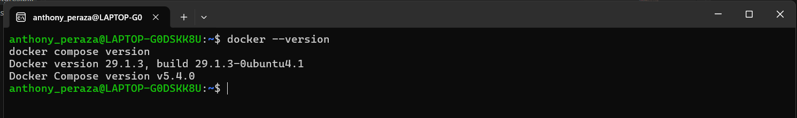
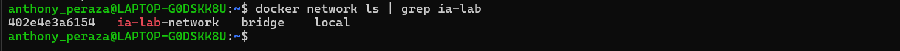
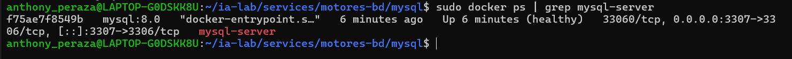

# Semana 1: Configuración de Infraestructura con Docker Compose

## 1. Requisitos Previos

- WSL2 instalado y funcionando
- Docker funcionando dentro de WSL
- Acceso a terminal bash en WSL

Verifica Docker:

``` bash
docker --version
docker compose version
```

<p align="center">
  
</p>

---------------------------------------------------------------------------------------------

## 2. Paso 1: Crear Carpetas

Abre tu terminal WSL y ejecuta:

``` bash
mkdir -p ~/ia-lab/services/motores-bd/{mysql,postgres,mssql,oracle}
mkdir -p ~/ia-lab/data/{mysql,postgres,mssql,oracle}
```

Verifica la estructura:

``` bash
tree ~/ia-lab/
```

<p align="center">
  
</p>

---------------------------------------------------------------------------------------------

## 3. Paso 2: Crear la Red Docker Compartida

Todos los contenedores compartirán una misma red Docker para comunicarse entre sí:

``` bash
docker network inspect ia-lab-network >/dev/null 2>&1 || docker network create ia-lab-network
```

Verifica que se creó:

``` bash
docker network ls | grep ia-lab
```

<p align="center">
  
</p>

---------------------------------------------------------------------------------------------

## 4. Paso 3: MySQL

### 4.1 Crear el archivo docker-compose.yml

``` bash
cat > ~/ia-lab/services/motores-bd/mysql/docker-compose.yml << 'EOF'
services:
  mysql:
    image: mysql:8.0
    container_name: mysql-server
    restart: unless-stopped
    env_file:
      - .env
    ports:
      - "3307:3306"
    volumes:
      - ../../../data/mysql:/var/lib/mysql
      - /mnt/c/academia/bd:/backups
    command: >
      --character-set-server=utf8mb4
      --collation-server=utf8mb4_unicode_ci
      --bind-address=0.0.0.0
    networks:
      - ia-lab-network
    healthcheck:
      test: ["CMD", "mysqladmin", "ping", "-h", "localhost"]
      interval: 10s
      timeout: 5s
      retries: 5
      start_period: 30s

networks:
  ia-lab-network:
    external: true
EOF
```

### 4.2 Crear el archivo .env

``` bash
cat > ~/ia-lab/services/motores-bd/mysql/.env << 'EOF'
TZ=America/Bogota
MYSQL_ROOT_PASSWORD=1234567
MYSQL_DATABASE=ImpulsaColectivo
EOF
```

### 4.3 Crear README.md

``` bash
cat > ~/ia-lab/services/motores-bd/mysql/README.md << 'EOF'
# MySQL 8.0 - Motor de Base de Datos

> **Acceso remoto habilitado.** Puerto expuesto en `0.0.0.0:3306`.
> **Usuario por defecto:** `root` (acceso remoto: `%`)

## Conectar desde WSL (local)

```bash
docker exec -it mysql-server mysql -u root -p
# Password: 1234567
EOF
```

---

## Conectar desde WSL (local)

```bash
docker exec -it mysql-server mysql -u root -p
# Password: 1234567
```

## Conectar remotamente desde cualquier equipo

Reemplaza `IP_SERVIDOR` por la IP de la maquina WSL:

``` bash
mysql -h 172.21.51.153 -P 3307 -u root -p
```

O con cliente grafico (MySQL Workbench, DBeaver, HeidiSQL): - **Host:** `172.21.51.153` - **Port:** `3307` - **User:** `root` - **Password:** `1234567`

## Crear un usuario PROPIO con ACCESO REMOTO

Conectate primero como root, luego ejecuta:

``` sql
-- Crear usuario propio con acceso desde CUALQUIER equipo (%)
CREATE USER 'anthony_mysql'@'%' IDENTIFIED BY '1234567';

-- Dar permisos sobre la base de datos
GRANT ALL PRIVILEGES ON ImpulsaColectivo.* TO 'anthony_mysql'@'%';
FLUSH PRIVILEGES;
```

## Backup de una base de datos

``` bash
docker exec mysql-server mysqldump -u root -p1234567 ImpulsaColectivo > /mnt/c/academia/bd/backup_mysql_ImpulsaColectivo_$(date +%Y%m%d).sql
```

## Variables clave del .env

| Variable              | Descripcion                                      |
|-----------------------|--------------------------------------------------|
| `MYSQL_ROOT_PASSWORD` | Password del usuario root                        |
| `MYSQL_DATABASE`      | Base de datos creada automaticamente al arrancar |        

### 4.4 Levantar MySQL

```bash
cd ~/ia-lab/services/motores-bd/mysql
docker compose up -d
```

Verificar que está corriendo:

``` bash
docker ps | grep mysql-server
docker logs mysql-server --tail 20
```

<p align="center">
  
</p>

------------------------------------------------------------------------------

## 5. Paso 4: PostgreSQL

### 5.1 Crear docker-compose.yml

``` bash
cat > ~/ia-lab/services/motores-bd/postgres/docker-compose.yml << 'EOF'
services:
  postgres:
    image: postgres:16
    container_name: postgres-server
    restart: unless-stopped
    env_file:
      - .env
    ports:
      - "5433:5432"
    volumes:
      - ../../../data/postgres:/var/lib/postgresql/data
      - /mnt/c/academia/bd:/backups
    networks:
      - ia-lab-network
    healthcheck:
      test: ["CMD-SHELL", "pg_isready -U $$POSTGRES_USER"]
      interval: 10s
      timeout: 5s
      retries: 5
      start_period: 20s

networks:
  ia-lab-network:
    external: true
EOF
```

### 5.2 Crear .env

``` bash
cat > ~/ia-lab/services/motores-bd/postgres/.env << 'EOF'
TZ=America/Bogota
POSTGRES_DB=ImpulsaColectivo 
POSTGRES_USER=anthony
POSTGRES_PASSWORD=1234567
PGDATA=/var/lib/postgresql/data
EOF
```

### 5.3 Crear README.md

``` bash
cat > ~/ia-lab/services/motores-bd/postgres/README.md << 'EOF'
# PostgreSQL 17 - Motor de Base de Datos

> **Acceso remoto habilitado.** Puerto expuesto en `0.0.0.0:5433`.
> **Usuario por defecto:** `anthony` (acceso remoto: sin restriccion de host)
EOF
```
------------------------------------------------------------------------------

## Conectar desde WSL (local)

```bash
docker exec -it postgres-server psql -U anthony -d ImpulsaColectivo
# Password: 1234567
```

## Conectar remotamente desde cualquier equipo

``` bash
psql -h 172.21.51.153 -p 5433 -U anthony -d ImpulsaColectivo
```

O con cliente grafico (pgAdmin, DBeaver): - **Host:** `172.21.51.153` - **Port:** `5433` - **User:** `anthony` - **Password:** `1234567` - **Database:** `ImpulsaColectivo`

## Crear un usuario PROPIO con ACCESO REMOTO

``` sql
-- Crear usuario propio (por defecto puede conectarse desde cualquier host)
CREATE USER anthony_postgres WITH PASSWORD '1234567';

-- Dar permisos sobre la base de datos
GRANT ALL PRIVILEGES ON DATABASE ImpulsaColectivo TO anthony_postgres;
ALTER DATABASE ImpulsaColectivo OWNER TO anthony_postgres;
```

## Backup de una base de datos

``` bash
docker exec postgres-server pg_dump -U anthony -d ImpulsaColectivo > /mnt/c/academia/bd/backup_postgres_ImpulsaColectivo_$(date +%Y%m%d).sql
```

## Variables clave del .env

| Variable            | Descripcion                              |
|---------------------|------------------------------------------|
| `POSTGRES_USER`     | Usuario administrador (anthony)          |
| `POSTGRES_PASSWORD` | Password del administrador               |
| `POSTGRES_DB`       | Base de datos inicial creada al arrancar |
      

### 5.4 Levantar PostgreSQL

```bash
cd ~/ia-lab/services/motores-bd/postgres
docker compose up -d
```

``` bash
docker ps | grep postgres-server
docker logs postgres-server --tail 20
```

<p align="center">
  
</p>

------------------------------------------------------------------------

## 6. Paso 5: SQL Server

### 6.1 Crear docker-compose.yml

``` bash
cat > ~/ia-lab/services/motores-bd/mssql/docker-compose.yml << 'EOF'
services:
  mssql:
    image: mcr.microsoft.com/mssql/server:2022-latest
    container_name: mssql-server
    restart: unless-stopped
    user: root
    env_file:
      - .env
    ports:
      - "1433:1433"
    volumes:
      - ../../../data/mssql:/var/opt/mssql
      - /mnt/c/academia/bd:/backups
    networks:
      - ia-lab-network
    healthcheck:
      test: ["CMD-SHELL", "/opt/mssql-tools18/bin/sqlcmd -S localhost -U sa -P \"$$MSSQL_SA_PASSWORD\" -C -Q 'SELECT 1' || exit 1"]
      interval: 15s
      timeout: 10s
      retries: 6
      start_period: 40s

networks:
  ia-lab-network:
    external: true
EOF
```

### 6.2 Crear .env

``` bash
cat > ~/ia-lab/services/motores-bd/mssql/.env << 'EOF'
TZ=America/Bogota
ACCEPT_EULA=Y
MSSQL_SA_PASSWORD=Anthony123456
MSSQL_PID=Developer
EOF
```

### 6.3 Crear README.md

``` bash
cat > ~/ia-lab/services/motores-bd/mssql/README.md << 'EOF'
# SQL Server 2022 - Motor de Base de Datos

> **Acceso remoto habilitado.** Puerto expuesto en `0.0.0.0:1433`.
> **Usuario por defecto:** `SA` (acceso remoto: habilitado por defecto)
EOF
```
-------------------------------------------------------------------------------------------------------------------------------------

## Conectar desde WSL (local)

```bash
docker exec -it mssql-server /opt/mssql-tools18/bin/sqlcmd -S localhost -U sa -P 'Anthony123456' -C
```

## Conectar remotamente desde cualquier equipo

``` bash
sqlcmd -S 172.21.51.153,1433 -U SA -P 'Anthony123456'
```

O con cliente grafico (Azure Data Studio, DBeaver, SSMS): - **Host:** `1172.21.51.153` - **Port:** `1433` - **User:** `SA` - **Password:** `Anthony123456`

## Crear un usuario PROPIO con ACCESO REMOTO

``` sql
-- Crear la base de datos
CREATE DATABASE ImpulsaColectivo;
GO

-- Crear login (autenticacion a nivel servidor, acceso remoto por defecto)
CREATE LOGIN anthony_login WITH PASSWORD = 'Anthony123456';
GO

-- Crear usuario dentro de la base de datos
USE ImpulsaColectivo;
GO
CREATE USER anthony FOR LOGIN anthony_login;
GO

-- Dar permisos de dueno de la base de datos
ALTER ROLE db_owner ADD MEMBER anthony;
GO
```

## Backup de una base de datos

``` bash
docker exec mssql-server /opt/mssql-tools18/bin/sqlcmd -S localhost -U SA -P 'Anthony123456' -C -Q "BACKUP DATABASE [ImpulsaColectivo] TO DISK = N'/backups/backup_mssql_ImpulsaColectivo_$(date +%Y%m%d).bak'"
```

## Variables clave del .env

| Variable            | Descripcion                             |
|---------------------|-----------------------------------------|
| `MSSQL_SA_PASSWORD` | Password del usuario SA (administrador) |
| `MSSQL_PID`         | Edicion de SQL Server (Developer)       |        

### 6.4 Levantar SQL Server

```bash
cd ~/ia-lab/services/motores-bd/mssql
docker compose up -d
```

Verificar que está corriendo:

``` bash
docker ps | grep mssql-server
docker logs mssql-server --tail 20
```

<p align="center">
  
</p>

------------------------------------------------------------------------

## 7. Paso 6: Oracle XE

### 7.1 Crear docker-compose.yml

``` bash
cat > ~/ia-lab/services/motores-bd/oracle/docker-compose.yml << 'EOF'
services:
  oracle:
    image: gvenzl/oracle-xe:21-slim
    container_name: oracle-xe
    restart: unless-stopped
    env_file:
      - .env
    ports:
      - "1521:1521"
      - "8080:8080"
    volumes:
      - ../../../data/oracle:/opt/oracle/oradata
      - /mnt/c/academia/bd:/backups
    networks:
      - ia-lab-network
    healthcheck:
      test: ["CMD", "healthcheck.sh"]
      interval: 15s
      timeout: 10s
      retries: 10
      start_period: 90s

networks:
  ia-lab-network:
    external: true
EOF
```

### 7.2 Crear .env

``` bash
cat > ~/ia-lab/services/motores-bd/oracle/.env << 'EOF'
TZ=America/Bogota
ORACLE_PASSWORD=Anthony123456
ORACLE_DATABASE=ImpulsaColectivo
EOF
```

### 7.3 Crear README.md

``` bash
cat > ~/ia-lab/services/motores-bd/oracle/README.md << 'EOF'
# Oracle XE - Motor de Base de Datos

> **Acceso remoto habilitado.** Puerto expuesto en `0.0.0.0:1521`.
> **Usuario por defecto:** `SYSTEM` (acceso remoto: habilitado via listener)
>
> **⚠️ Estado actual:** Este contenedor puede tener problemas de inicializacion en WSL.
> La imagen `gvenzl/oracle-xe` requiere configuracion adicional.
EOF
```
--------------------------------------------------------------------------------

## Conectar desde WSL (local)

```bash
docker exec -it oracle-xe sqlplus system/Anthony123456@XEPDB1
```

## Conectar remotamente desde cualquier equipo

``` bash
sqlplus system/Anthony123456@//172.21.51.153:1521/XEPDB1
```

O con cliente grafico (SQL Developer, DBeaver): - **Host:** `172.21.51.153` - **Port:** `1521` - **Service Name:** `XEPDB1` - **User:** `SYSTEM` - **Password:** `Anthony123456`

## Crear un usuario PROPIO con ACCESO REMOTO

``` sql
-- Crear tablespace para el usuario
CREATE TABLESPACE mi_ts DATAFILE '/opt/oracle/oradata/XE/XEPDB1/mi_ts.dbf' SIZE 100M AUTOEXTEND ON;

-- Crear usuario propio (puede conectarse desde cualquier host via listener)
CREATE USER ImpulsaColectivo IDENTIFIED BY OracleXe1521 DEFAULT TABLESPACE mi_ts QUOTA UNLIMITED ON mi_ts;

-- Dar permisos basicos
GRANT CREATE SESSION, CREATE TABLE, CREATE VIEW, CREATE SEQUENCE, CREATE TRIGGER TO ImpulsaColectivo;

-- Opcional: dar permisos de DBA
GRANT DBA TO ImpulsaColectivo;
```

## Variables clave del .env

| Variable          | Descripcion                 |
|-------------------|-----------------------------|
| `ORACLE_PASSWORD` | Password del usuario SYSTEM |
| `ORACLE_DATABASE` | Nombre de la instancia (XE) |         

### 7.4 Levantar Oracle

```bash
cd ~/ia-lab/services/motores-bd/oracle
docker compose up -d
```

Verificar que está corriendo:

``` bash
docker ps | grep oracle-xe
docker logs -f oracle-xe
```

<p align="center">
  
</p>

------------------------------------------------------------------------

**Autor:** Anthony Peraza\
**Version:** 1.0\
**Fecha:** 2026-08-14
